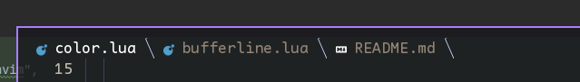

# bufline.nvim

🤏 A lua buffer line.



## 🤖 Installation

```text
{
    "fzdwx/bufline.nvim",
    event = "VeryLazy",
    config = function()
        local buf = require("bufline")
        buf.setup({
            separator = function(index)
                return {
                    str = '',
                    hl = ""
                }
            end
        })
    end,
},
```

## 💥 Highlight

```text
BufLineTitleSel
BufLineTitleNoSel
BufLineFill
BufLine
```

## Thanks
1. [luatab](https://github.com/alvarosevilla95/luatab.nvim)
2. [barbar](https://github.com/romgrk/barbar.nvim)